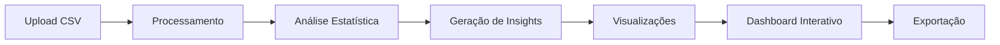

# ⚽ FootEscala V1

> Sistema de Gestão e Análise de Escalas de Trabalho para Eventos Esportivos

[](https://github.com/jniorpoa/FootEscalaV1)
[](LICENSE)
[](https://reactjs.org/)
[](https://vitejs.dev/)

## 🌐 Acesso

**Produção:** [https://footescala.jniorpoa.com/v1](https://footescala.jniorpoa.com/v1)

---

## 📋 Índice

- [Sobre](#sobre)
- [Funcionalidades](#funcionalidades)
- [Tecnologias](#tecnologias)
- [Arquitetura](#arquitetura)
- [Instalação](#instalação)
- [Uso](#uso)
- [API de Dados](#api-de-dados)
- [Versionamento](#versionamento)
- [Contribuindo](#contribuindo)
- [Changelog](#changelog)
- [Licença](#licença)

---

## 🎯 Sobre

O **FootEscala V1** é um sistema web desenvolvido para gerenciar e analisar escalas de trabalho em eventos esportivos. A plataforma processa arquivos CSV contendo informações de eventos e funcionários, gerando análises estatísticas detalhadas, gráficos interativos e insights automáticos para otimização da distribuição de trabalho.

### 🎮 Demo


---

## ✨ Funcionalidades

### 📊 Análise de Dados
- **Upload Múltiplo de CSVs**: Processa vários meses simultaneamente
- **3 Modos de Visualização**:
  - 📅 **Individual**: Análise detalhada por mês
  - 🔄 **Comparação**: Compare múltiplos períodos
  - 📈 **Consolidado**: Visão unificada de todos os dados

### 📈 Visualizações
- **7 Tipos de Gráficos Interativos**:
  - 📊 Ranking de horas por funcionário
  - 🥧 Distribuição percentual de carga
  - 📉 Evolução diária de eventos
  - 🕐 Distribuição por horário
  - 📅 Análise por dia da semana (Radar)
  - 📈 Horas acumuladas (Área)
  - 📊 Comparação entre períodos

### 🧠 Inteligência Analítica
- **Insights Automáticos**:
  - 🏆 Top performers
  - 📅 Dias mais movimentados
  - ⏰ Horários de pico
  - ⚖️ Análise de distribuição

- **Detecção de Anomalias**:
  - ⚠️ Sobrecarga de funcionários (>2σ)
  - 📉 Subutilização de recursos
  - 🔍 Gaps temporais
  - 📊 Desequilíbrios na distribuição

### 📤 Exportação
- **CSV**: Relatórios tabulados completos
- **Filtros**: Mantém configurações na exportação
- **Impressão**: Layout otimizado para PDF

### 🎨 Interface
- **Design Clean e Moderno**
- **100% Responsivo**
- **Tema Claro**
- **Navegação Intuitiva por Tabs**
- **Tooltips Informativos**

---

## 🛠 Tecnologias

### Frontend
- **React 18.2** - Interface reativa
- **TypeScript** - Type safety
- **Vite 5.0** - Build tool moderna
- **TailwindCSS 3.4** - Estilização utility-first

### Visualização de Dados
- **Recharts 2.10** - Gráficos interativos
- **Lucide React** - Ícones modernos

### Processamento
- **Papaparse 5.4** - Parser de CSV robusto
- **Lodash 4.17** - Utilitários de manipulação

### Infraestrutura
- **Nginx** - Servidor web
- **Ubuntu 22.04 LTS** - Sistema operacional
- **AWS EC2** - Cloud hosting

---

## 🏗 Arquitetura

```
FootEscala V1
├── 📱 Frontend (React + Vite)
│   ├── Componente principal (FootEscalaV1.tsx)
│   ├── Processamento de CSV
│   ├── Geração de gráficos
│   └── Exportação de dados
│
├── 🌐 Servidor Web (Nginx)
│   ├── Serve arquivos estáticos
│   ├── Gzip compression
│   └── Cache de assets
│
└── ☁️ Infraestrutura (AWS EC2)
    ├── Ubuntu 22.04 LTS
    ├── Node.js 18
    └── Certificado SSL (Let's Encrypt)
```

### Fluxo de Dados



---

## 📦 Instalação

### Requisitos
- Ubuntu 22.04 LTS
- Node.js 18+
- Nginx
- 2GB RAM mínimo
- 20GB storage

### 🚀 Deploy Rápido

Para instruções detalhadas de instalação, consulte o [SETUP.md](SETUP.md)

```bash
# Clone o repositório
git clone https://github.com/jniorpoa/FootEscalaV1.git
cd FootEscalaV1

# Execute o instalador
chmod +x install.sh
./install.sh

# Acesse
http://seu-servidor/v1
```

---

## 📖 Uso

### 1. Upload de Dados
- Prepare seus CSVs com a estrutura:
  ```csv
  DATA,HORARIO,CONFRONTO,COLETOR_1,COLETOR_2
  01/01/2025,09:30,Time A x Time B,João Silva,Maria Santos
  ```

### 2. Análise
- Faça upload de um ou múltiplos arquivos
- Escolha o modo de visualização
- Aplique filtros por funcionário
- Navegue pelos diferentes gráficos

### 3. Interpretação
- **Horas por evento**: 2 horas fixas
- **Status Normal**: Dentro da média ± 1σ
- **Status Alto**: Entre 1σ e 2σ acima da média
- **Status Sobrecarga**: Mais de 2σ acima da média
- **Status Baixo**: Mais de 1σ abaixo da média

### 4. Exportação
- Clique em "Exportar" para baixar CSV
- Use Ctrl+P para imprimir/PDF

---

## 📊 API de Dados

### Estrutura do CSV

| Campo | Tipo | Descrição | Exemplo |
|-------|------|-----------|---------|
| DATA | String | Data do evento (DD/MM/AAAA) | 01/01/2025 |
| HORARIO | String | Horário do evento (HH:MM) | 09:30 |
| CONFRONTO | String | Descrição do evento | Time A x Time B |
| COLETOR_1 | String | Primeiro funcionário | João Silva |
| COLETOR_2 | String | Segundo funcionário | Maria Santos |

### Métricas Calculadas

```javascript
{
  totalEventos: number,        // Total de eventos no período
  totalHoras: number,          // Total de horas (eventos × 2h × 2 funcionários)
  totalFuncionarios: number,   // Funcionários únicos
  mediaHorasPorFuncionario: number,  // Média de horas
  desvioPadrao: number        // Desvio padrão (σ)
}
```

---

## 🔄 Versionamento

O FootEscala utiliza versionamento semântico e URLs versionadas:

- **V1** (atual): `footescala.jniorpoa.com/v1` - Versão inicial com funcionalidades base
- **V2** (planejado): `footescala.jniorpoa.com/v2` - Análise preditiva e ML
- **V3** (futuro): `footescala.jniorpoa.com/v3` - Integração com APIs externas

### Roadmap

#### ✅ V1.0.0 (Atual)
- [x] Upload e processamento de CSV
- [x] Análise estatística básica
- [x] 7 tipos de visualizações
- [x] Insights automáticos
- [x] Exportação de dados

#### 🚧 V2.0.0 (Q2 2025)
- [ ] Análise preditiva com ML
- [ ] Sugestões automáticas de escala
- [ ] API REST para integração
- [ ] Dashboard em tempo real
- [ ] Notificações automáticas

#### 💡 V3.0.0 (Q4 2025)
- [ ] App mobile
- [ ] Integração com calendários
- [ ] Gestão de férias/ausências
- [ ] Cálculo de custos
- [ ] Multi-tenancy

---

## 🤝 Contribuindo

Contribuições são bem-vindas! Por favor, leia [CONTRIBUTING.md](CONTRIBUTING.md) para detalhes sobre nosso código de conduta e processo de submissão de pull requests.

### Como Contribuir

1. Fork o projeto
2. Crie sua feature branch (`git checkout -b feature/AmazingFeature`)
3. Commit suas mudanças (`git commit -m 'Add some AmazingFeature'`)
4. Push para a branch (`git push origin feature/AmazingFeature`)
5. Abra um Pull Request

---

## 📝 Changelog

### [1.0.0] - 2025-01-28
#### Adicionado
- Sistema completo de análise de escalas
- Upload múltiplo de CSVs
- 7 tipos de visualizações interativas
- Insights e anomalias automáticas
- 3 modos de visualização
- Exportação em CSV
- Interface responsiva com Tailwind
- Deploy automatizado para AWS EC2

#### Melhorado
- Design clean e moderno
- Performance otimizada com Vite
- Compressão Gzip no Nginx
- Cache de assets estáticos

---

## 📄 Licença

Este projeto está licenciado sob a Licença MIT - veja o arquivo [LICENSE](LICENSE) para detalhes.

---

## 👥 Equipe

**Desenvolvido por:** [João Nior Poa](https://github.com/jniorpoa)

**Contato:** footescala@jniorpoa.com

---

## 🙏 Agradecimentos

- Time de eventos esportivos pela colaboração
- Comunidade React pelos recursos
- AWS pela infraestrutura

---

<div align="center">

**[Demo](https://footescala.jniorpoa.com/v1)** • **[Documentação](https://github.com/jniorpoa/FootEscalaV1/wiki)** • **[Issues](https://github.com/jniorpoa/FootEscalaV1/issues)**

Made with ❤️ by João Nior Poa

</div>
